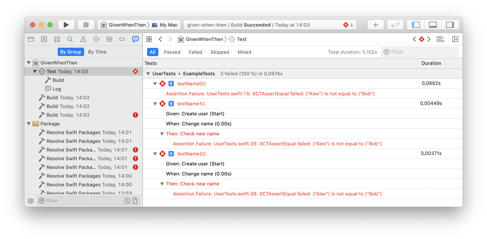

# Given-When-Then

[](https://swift.org/package-manager)
[](https://github.com/Alexander-Ignition/OSLogging/blob/master/LICENSE)

`GivenWhenThen` provide a `TestCase` class with helpers methods `given`, `when`  and `then`.

They will make it more expressive to view tests in Xcode Report Navigator.

## Installation

Add dependency to `Package.swift`...

```swift
.package(url: "https://github.com/Alexander-Ignition/given-when-then", from: "0.0.1"),
```

... and your target

```swift
.testTarget(name: "AppTests", dependencies: [
    .product(name: "GivenWhenThen", package: "given-when-then")
]),
```

## Usage

Inherit from `TestCase` and the `given`, `when` and `then`methods will be available to you.

```swift
import XCTest
import GivenWhenThen
@testable import Example

final class UserTests: TestCase {

    func testName2() {
        given("Create user")
        var user = User(name: "Alex")

        when("Change name")
        user.name = "Bob"

        then("Check new name")
        XCTAssertEqual(user.name, "Bob")
    }
}
```
## Сomparison with other approaches

1. open Tests/ExampleTests/UserTests.swift
2. run tests
3. see results in Xcode Report Navigator

- Comments are not visible in the report
- `XCTContext` is too verbose

```swift
import XCTest
import GivenWhenThen
@testable import Example

final class UserTests: TestCase {

    func testName0() {
        // Given
        var user = User(name: "Alex")

        // When
        user.name = "Bob"

        // Then
        XCTAssertEqual(user.name, "Bob")
    }

    func testName1() {
        var user = XCTContext.runActivity(named: "Given: Create user") { _ -> User in
            return User(name: "Alex")
        }
        XCTContext.runActivity(named: "When: Change name") { _ -> Void in
            user.name = "Bob"
        }
        XCTContext.runActivity(named: "Then: Check new name") { _ -> Void in
            XCTAssertEqual(user.name, "Bob")
        }
    }

    func testName2() {
        given("Create user")
        var user = User(name: "Alex")

        when("Change name")
        user.name = "Bob"

        then("Check new name")
        XCTAssertEqual(user.name, "Bob")
    }
}
```


